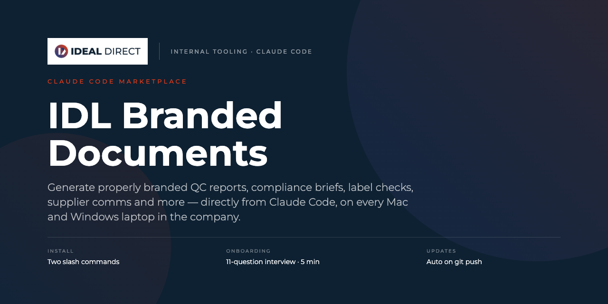
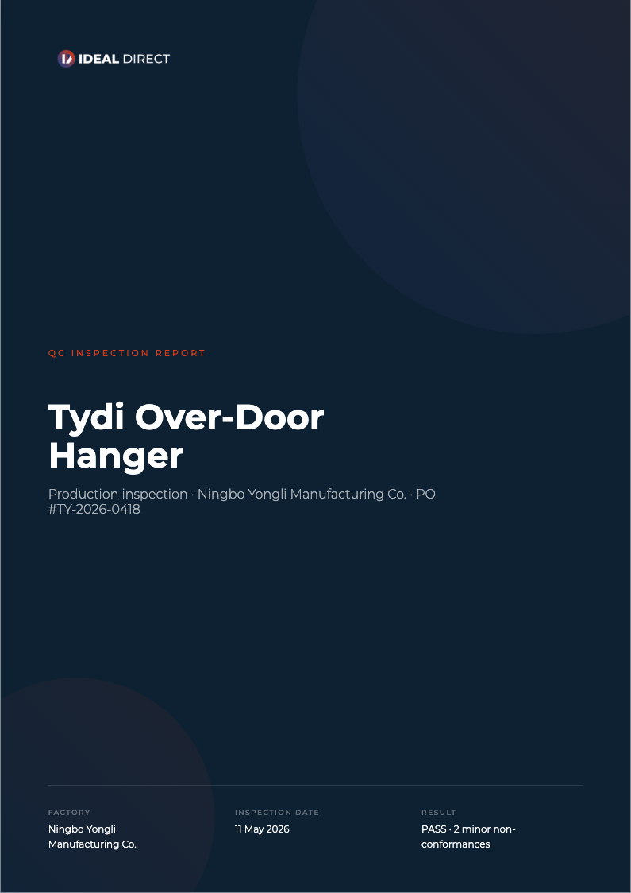
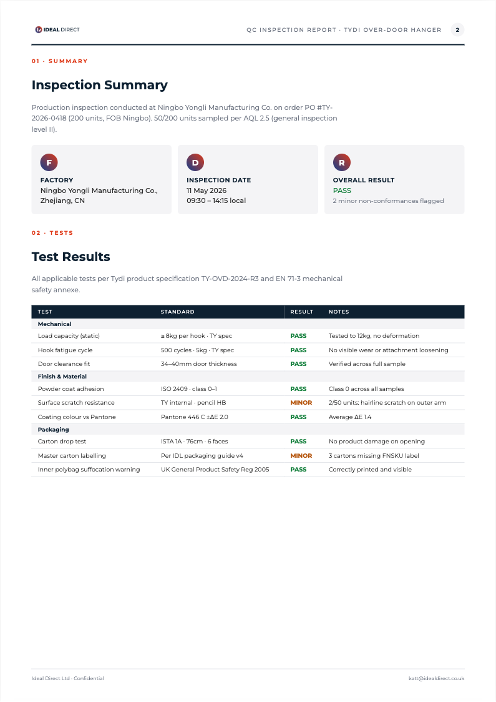
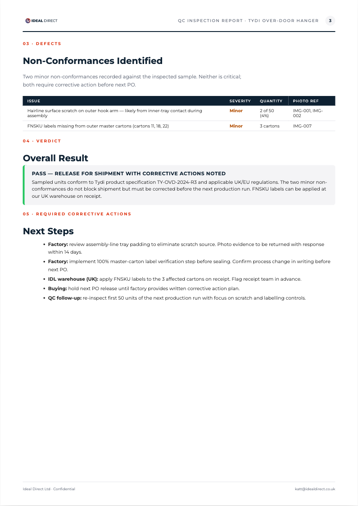

<p align="center">
  
</p>

<p align="center">
  <a href="#install-3-steps-7-minutes-total"></a>
  <a href="#daily-use"></a>
  <a href="#updates"></a>
  
</p>

---

# Ideal Direct — Claude Code Skills

Internal Claude Code marketplace for Ideal Direct staff. Currently distributes one plugin: **`idl-brand-documents`**.

---

## What this gives you

After a one-time install (~30 seconds) and a one-time onboarding interview (~5 minutes), you can generate branded Ideal Direct documents directly from the Claude desktop app or terminal.

Just say something like:

> make me a branded QC report for the Tydi over-door hanger from Ningbo Factory — 50/200 inspected, 2 minor stitching defects

…and you get a fully branded multi-page `.html` saved to your local outputs folder, ready to print as PDF. Like this:

<p align="center">
  <a href="assets/sample-qc-report.html"></a>
  <a href="assets/sample-qc-report.html"></a>
  <a href="assets/sample-qc-report.html"></a>
</p>

<p align="center"><sub>Real output — three-page A4 QC Inspection Report. <a href="assets/sample-qc-report.html">View the full HTML</a> · open in Chrome → ⌘P / Ctrl+P → Save as PDF.</sub></p>

---

## Install — proven SOP

Each step says *what to do* and *what you should see*. If something doesn't match, stop and message Sim before going further.

### 1. Install the Claude desktop app

**Do:** Download from https://claude.ai/download (Mac or Windows). Sign in once.

**See:** The Claude app opens.

### 2. Run the one-line installer

This downloads the IDL skill straight from GitHub and drops it into the right place on your computer. No git, no extra tools, no `claude` CLI required.

#### On a Mac

Open Terminal (press `⌘ + Space` → type `Terminal` → Enter), paste this single line, press Enter:

```
curl -fsSL https://raw.githubusercontent.com/simmahon/idl-claude-skills/main/install.sh | bash
```

#### On Windows

Open PowerShell (press the `Windows` key → type `PowerShell` → Enter), paste this single line, press Enter:

```
irm https://raw.githubusercontent.com/simmahon/idl-claude-skills/main/install.ps1 | iex
```

**See (either OS, over ~5 seconds):**

```
Installing IDL Branded Documents skill…
Downloading from GitHub… done
Extracting… done
Installing… done
✓ Installed to /Users/{you}/.claude/skills/idl-brand-documents
```

> **Why this approach:** The Claude desktop app does NOT include the `claude` command-line tool by default — only the GUI. Earlier instructions used `claude plugin marketplace add ...`, which only works if you've separately installed the Claude Code CLI (most employees haven't). This installer skips that prerequisite entirely — it just downloads the skill files into the standard location the desktop app reads.

### 3. Verify the install

**Do:** Quit the Claude app fully — **Mac:** `⌘ + Q`. **Windows:** right-click the Claude icon in the system tray (bottom-right) and pick **Quit**, *or* close all Claude windows. Reopen the app.

Then click **Customize** in the left sidebar.

**See:** Under "Skills" you should see `idl-brand-documents` listed.

### 4. Create your IDL working folder (one time, ~5 seconds)

This is the folder you'll open every time you start a Claude Code session. Keeping it consistent prevents Claude from accidentally loading context from unrelated projects.

**Mac:** Finder → click **Documents** in the sidebar → right-click empty space → **New Folder** → name it `IDL-Claude`.

**Windows:** File Explorer → click **Documents** → right-click empty space → **New** → **Folder** → name it `IDL-Claude`.

> **If you already have a dedicated IDL working folder** (from previous Claude or Cowork work), skip this step and use that folder instead.

### 5. Run the one-time onboarding

**Do:** Click **Code** at the top → **+ New session** → pick the `IDL-Claude` folder you just made (or your existing IDL folder). Type:

```
start the IDL onboarding
```

**See:** Claude asks 11 questions (~5 minutes). Answer them, confirm the summary. You're set up.

> From now on, **always open the same folder** when starting a Claude Code session. This keeps your context clean and your tokens cheap.

---

## Daily use

Everything below this line stays inside the Claude desktop app's **Code** tab — no Terminal needed ever again.

Say what you need in plain English. Trigger phrases include "branded document", "branded doc", "QC report", "compliance brief", "label check", "supplier message", "listing check".

Examples:

- *make me a branded QC report for the Tydi over-door hanger from Ningbo Factory — passed inspection, no defects*
- *draft a branded supplier message to Yiwu Factory about Q2 carton labelling*
- *branded label compliance check for our new pest spray for UK and EU — text version of the back panel attached*
- *branded pre-launch compliance brief for the new iMedic blood pressure monitor — UK launch in July*
- *format this QC report for me* (paste raw factory data underneath)

Files save to the location you chose during onboarding. The default depends on your OS:
- **Mac:** `~/Ideal Direct Outputs/{your-role}/{YYYY-MM}/`
- **Windows:** `C:\Users\{your-username}\Ideal Direct Outputs\{your-role}\{YYYY-MM}\`

To turn the saved `.html` into a PDF: open it in Google Chrome → **⌘P** (Mac) or **Ctrl+P** (Windows) → Destination: **Save as PDF** → Margins: **None** → Background graphics: **on** → **Save**.

### Check or change your profile

Your IDL profile (saved during onboarding) lives at:
- **Mac:** `~/.claude/idl-profile.json`
- **Windows:** `C:\Users\{your-username}\.claude\idl-profile.json`

To inspect or change it without opening any files manually:

- *show my IDL profile* — Claude reads the file and gives you a clean summary
- *redo my IDL onboarding* — runs the 11 questions again and overwrites your profile

---

## Updates

When we push changes to this repo, get the latest version by **re-running the same installer command** you used the first time:

**Mac:**
```
curl -fsSL https://raw.githubusercontent.com/simmahon/idl-claude-skills/main/install.sh | bash
```

**Windows:**
```
irm https://raw.githubusercontent.com/simmahon/idl-claude-skills/main/install.ps1 | iex
```

The installer automatically backs up your existing version (with a timestamp) before installing the new one. Your interview answers (`~/.claude/idl-profile.json` on Mac, `%USERPROFILE%\.claude\idl-profile.json` on Windows) are **never touched** by the installer — they survive every update.

After updating, quit and reopen the Claude desktop app to pick up the new version.

---

## Where things live on your computer

| What | Mac path | Windows path |
|---|---|---|
| The plugin (managed by Claude Code, don't touch) | `~/.claude/plugins/cache/ideal-direct/idl-brand-documents/` | `%USERPROFILE%\.claude\plugins\cache\ideal-direct\idl-brand-documents\` |
| Your interview answers (IDL profile) | `~/.claude/idl-profile.json` | `%USERPROFILE%\.claude\idl-profile.json` |
| Your IDL working folder (session) | `~/Documents/IDL-Claude/` | `%USERPROFILE%\Documents\IDL-Claude\` |
| Your finished documents | The save path you chose during onboarding | The save path you chose during onboarding |

> **Tip:** In Windows File Explorer, paste `%USERPROFILE%\.claude` into the address bar to jump to the hidden Claude config folder. On Mac, in Finder press `⌘ + Shift + G` and paste `~/.claude`.

---

## Troubleshooting

| Problem | Fix |
|---|---|
| Terminal says `claude: command not found` when running an install command | Old instructions told people to run `claude plugin marketplace add ...`. That requires the standalone Claude Code CLI which the desktop app does NOT bundle. Use the **one-line installer in Step 2** instead — it has no `claude` prerequisite. |
| Customize panel doesn't show the skill after install | Quit the Claude app fully (Mac: `⌘ + Q`. Windows: right-click tray icon → Quit), reopen, check Customize again. The app re-scans skills on startup. |
| PowerShell shows a security warning when running the install line | Windows sometimes gates pasted commands. Accept (Y) when prompted. If it blocks with an "execution policy" error, open PowerShell as Administrator and run: `Set-ExecutionPolicy -Scope CurrentUser RemoteSigned`, then re-run the installer. |
| Mac says `curl: command not found` | Extremely rare on macOS. Open Terminal, type `xcode-select --install`, accept the prompt, wait for install to finish, then re-run the installer. |
| Onboarding asks the same question twice | Quit Claude Code, restart, try again. If it persists, message Sim. |
| Generated file doesn't appear | Read Claude's last message — it tells you the exact path. Most often the save folder hasn't been created yet. |
| Want to re-do onboarding (e.g. role change) | Type: `redo my IDL onboarding`. Claude will overwrite your existing profile. |
| File paths look wrong on Windows (`~/something`) | The `~` shorthand is Mac/Linux. On Windows it expands to `C:\Users\{your-username}\`. Modern tools usually translate it automatically; if not, type the full Windows path. |

If you're stuck for more than a couple of minutes, message Sim with a screenshot.

---

## For maintainers

### Repo structure

```
.
├── README.md
├── install.sh                    ← Mac/Linux one-line installer (curl|bash)
├── install.ps1                   ← Windows one-line installer (irm|iex)
├── assets/                       ← README banner + sample QC report screenshots
├── .claude-plugin/
│   └── marketplace.json          ← marketplace catalogue (for power users with the Claude Code CLI)
└── plugins/
    └── idl-brand-documents/
        ├── .claude-plugin/
        │   └── plugin.json       ← plugin manifest (version omitted = every commit = new version)
        └── skills/
            └── idl-brand-documents/
                ├── SKILL.md      ← what triggers the skill, what to do
                ├── references/   ← lazy-loaded — design system, brand voice, interview, etc.
                ├── templates/    ← lazy-loaded — one per document type
                └── assets/       ← lazy-loaded — base64 logos
```

### How updates reach employees

- Edit any file in `plugins/idl-brand-documents/skills/idl-brand-documents/`
- `git push` to main
- Employees re-run their installer line (Mac: `curl ... | bash`, Windows: `irm ... | iex`) — see the [Updates](#updates) section above
- Their interview answers (`~/.claude/idl-profile.json`) are kept across updates

### Power-user install path (with the standalone Claude Code CLI)

If you have the standalone `claude` CLI installed (separate from the desktop app — usually via `curl -fsSL https://claude.com/install.sh | bash`), you can use the proper plugin marketplace system instead, which gives you auto-updates:

```
claude plugin marketplace add simmahon/idl-claude-skills
claude plugin install idl-brand-documents@ideal-direct
```

This route is documented for completeness but **not** what employees should use — most don't have the standalone CLI and the desktop app doesn't bundle it. The shell installers in the [Install](#install--proven-sop) section are the right path for everyone else.

### Validate before pushing

If you have the CLI:
```
claude plugin validate .
```
